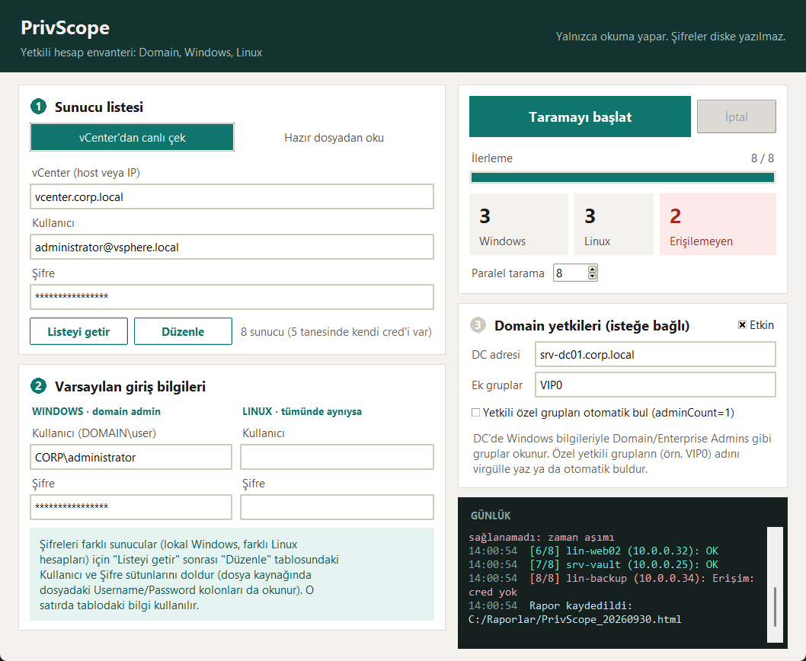
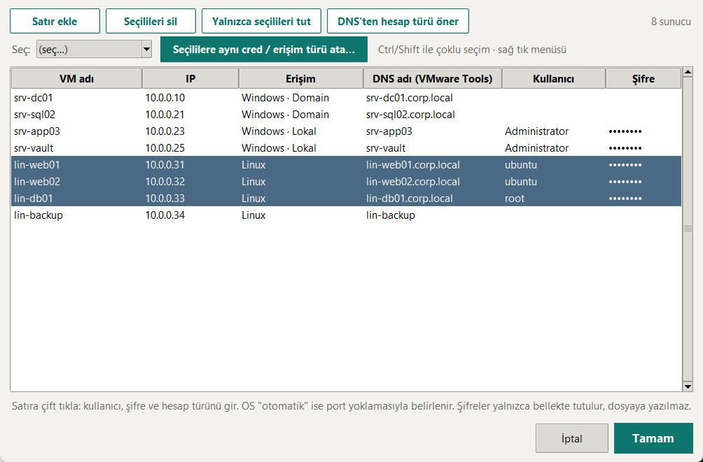
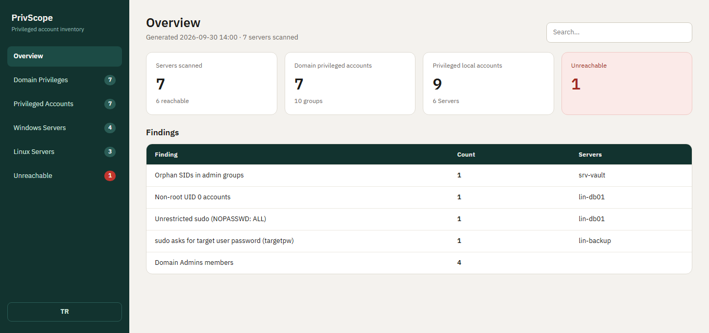
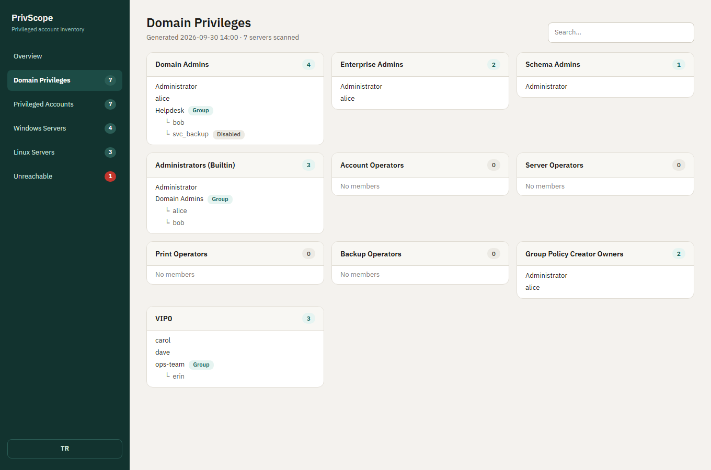
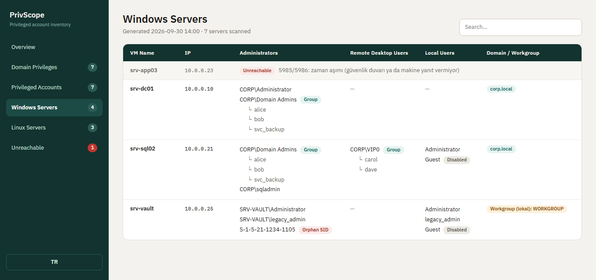

# PrivScope

**Sunucularınızda kimin yönetici (yetkili) olduğunu tek bakışta gösteren envanter aracı.**
Domain, Windows ve Linux sunucuları tarar; kimin domain admin, yerel Administrators, root ya da sudo yetkisi olduğunu
tek dosyalık, aranabilir bir HTML rapora döker. Yalnızca **okuma** yapar, hiçbir hesabı değiştirmez.
Şifreler yalnızca bellekte tutulur, diske yazılmaz ve günlüğe basılmaz.



## Neler yapar?

- **Domain yetkileri:** Domain Admins, Enterprise Admins, Schema Admins, Administrators, Operator grupları ve Group Policy Creator Owners. Kendi **özel yetkili gruplarını** da (örn. `VIP0`) ekleyebilir ya da otomatik buldurabilirsin.
- **İç içe gruplar açılır:** Bir grubun üyesi başka bir grupsa altındaki kullanıcılar da listelenir.
- **Windows sunucular:** Yerel Administrators, Remote Desktop Users, lokal kullanıcılar (devre dışı olanlar işaretli), silinmiş hesaplar (orphan SID), domain mi workgroup mu.
- **Linux sunucular:** UID 0 hesapları, `sudo`/`wheel`/`admin` grup üyeleri, sudoers kuralları, login shell'i olan kullanıcılar (kilitli olanlar işaretli).
- **Bulgular:** Riskli durumlar Özet sayfasında otomatik listelenir (silinmiş hesap, root dışı UID 0, `NOPASSWD: ALL` vb.).
- **Farklı erişim yolları:** Windows'ta WinRM, yoksa WMI/DCOM, o da yoksa ADSI; Linux'ta SSH. Domain'deki makine de, domain dışındaki lokal makine de taranır.

## EXE ile hızlı başlangıç

1. [Releases](https://github.com/kursatbal/privscope/releases/latest) sayfasından `PrivScope.exe` dosyasını indir ve çalıştır (kurulum gerekmez). Exe imzasız olduğu için Windows SmartScreen uyarı verebilir (**Daha fazla bilgi → Yine de çalıştır**); bazı antivirüsler PyInstaller ile paketlenmiş araçları yanlış işaretleyebilir. Güvenmek istemezsen kaynağı okuyup kendin derleyebilirsin: [EXE üretme](#exe-üretme). İndirdiğin dosyayı Releases sayfasındaki SHA256 değeriyle karşılaştırabilirsin.
2. **Sunucu listesi** kartında kaynağı seç ve listeyi getir.
3. Windows / Linux giriş bilgilerini gir (farklı şifreliler için listede satır satır).
4. **Taramayı başlat**, kayıt yerini seç.
5. Bitince açılan HTML raporu tarayıcıda aç.

Uygulamanın içinde, sağ üstteki **Yardım (F1)** düğmesi kısa bir kullanım kılavuzu açar (adımlar, erişim türleri, hedeflerde gerekenler, sık hatalar).

## Adım adım kullanım

### 1) Sunucu listesi

İki kaynaktan biri:

| Kaynak | Ne zaman |
|---|---|
| **vCenter'dan canlı çek** | vCenter erişimin varsa. Açık VM'ler ve işletim sistemi otomatik gelir. Appliance/altyapı VM'leri (`vCLS`, `vcsa`, `photon` vb.) elenir. |
| **Hazır dosyadan oku** | RVTools `.xlsx`, Excel, CSV ya da düz txt (satır başına bir IP). RVTools'un `vInfo` sayfasındaki OS ve IP kolonlarından işletim sistemi otomatik alınır. |

**Listeyi getir**'e basınca liste uygulamaya yüklenir ve düzenleme tablosu açılır. Bu tabloyu daha sonra **Düzenle** ile tekrar açabilirsin.

### 2) Listeyi düzenle (Excel açmadan)



- **Satıra çift tıkla** (ya da Enter): VM adı, IP, **Erişim**, kullanıcı ve şifreyi gir.
- **Erişim** seçenekleri:

| Erişim | Anlamı |
|---|---|
| `Windows · Domain` | Domain'e bağlı Windows. Üst ekrandaki domain admin bilgisi kullanılır. |
| `Windows · Lokal` | Domain dışı Windows. Satırdaki lokal hesap (örn. `Administrator`) kullanılır. |
| `Windows · otomatik` | Satırda cred varsa o, yoksa domain admin. |
| `Linux` | SSH ile bağlanır. Satırdaki kullanıcı/şifre kullanılır. |
| `otomatik` | İşletim sistemi bilinmiyorsa portlara bakılarak belirlenir. |

- **Toplu cred (30 Linux'un 15'i aynı şifreliyse):** satırları Ctrl/Shift ile seç (ya da **Seç:** listesinden *Linux*, *Windows*, *Cred'siz olanlar*…), **Seçililere aynı cred / erişim türü ata…** de. Sağ tık menüsünde de var. Kalanlara satıra çift tıklayıp tek tek gir.
- **DNS'ten hesap türü öner:** Windows satırlarında noktalı DNS adı (`sunucu.firma.local`) varsa Domain, kısa adsa Lokal önerir. Bu bir tahmindir; rapordaki **Domain / Workgroup** kolonu gerçeği gösterir.
- Başlığa tıklayınca sıralanır (A-Z, tekrar tıkla Z-A). **Yalnızca seçilileri tut** yetkili olduğun makineleri ayıklamaya yarar.
- Düzenlenen liste taramada doğrudan kullanılır. Kaynağı ya da dosyayı değiştirirsen liste sıfırlanır.

### 3) Varsayılan giriş bilgileri

- **Windows:** domain admin (`ALAN\kullanici`). `Windows · Domain` satırlarında kullanılır.
- **Linux:** tüm sunucularda aynıysa buraya. Farklıysa boş bırakıp tabloya gir.

### 4) Domain yetkileri (isteğe bağlı)

**Etkin** kutusunu işaretle, DC adresini yaz. Windows domain admin bilgisiyle DC'ye bağlanılır (DC'de ActiveDirectory modülü olmalı).

- **Ek gruplar:** Standart olmayan ama yüksek yetkili grupların adını virgülle yaz: `VIP0, Server Admins`.
- **Yetkili özel grupları otomatik bul:** Active Directory'nin "yetkili" işaretini (`adminCount=1`) taşıyan özel grupları kendisi bulur. Yetkisi grup üyeliğinden değil delegasyondan geliyorsa bu işaret olmaz, o zaman adını *Ek gruplar*a yaz.

Domain seçeneği açıkken sunucuların yerel yönetici grubunda geçen domain grupları da DC'den çözülüp altlarına eklenir.

### 5) Tara ve raporu aç

**Taramayı başlat**'a bas. İlerleme çubuğu, Windows/Linux/Erişilemeyen sayaçları ve günlük canlı akar. `OK` yeşil, hatalar kırmızı görünür.

## Raporu okuma

Tek dosyalık HTML: sunucuya gerek yok, tarayıcıda açılır. Solda sayfalar (sayı rozetli), üstte arama kutusu, altta **TR/EN** düğmesi.

| Sayfa | İçerik |
|---|---|
| **Overview** | Taranan sunucu, yetkili hesap sayıları ve **Bulgular** tablosu |
| **Domain Privileges** | Her yetkili grup bir kart; iç içe gruplar `└` ile açılır |
| **Privileged Accounts** | Hesap bazlı görünüm: bir hesap hangi yetkili gruplarda (`via Grup` = iç içe üyelik) |
| **Windows Servers** | Sunucu başına yerel yöneticiler, RDP, lokal kullanıcılar, Domain/Workgroup |
| **Linux Servers** | UID 0, sudo grubu, sudoers kuralları, kullanıcılar |
| **Unreachable** | Bağlanılamayan sunucular ve sebepleri |








**Rozetler:** `Group` (grup), `Disabled` (devre dışı), `Locked` (kilitli), `Orphan SID` (silinmiş hesap), `Unreachable` (erişilemedi).

## Erişim yöntemleri ve gereksinimler

PrivScope her hedefe **kendi çalıştığı Windows bilgisayardan** bağlanır ve yalnızca okuma yapar. Hedef makinede ajan kurmaz, dosya bırakmaz, ayar değiştirmez. Hangi hedefe nasıl bağlanacağı **Erişim** seçimine ve girdiğin kullanıcıya bağlıdır.

### Genel bakış

| Hedef | Erişim seçimi | Bağlantı | Hangi hesap |
|---|---|---|---|
| Domain'e bağlı Windows | `Windows · Domain` | WinRM → WMI/DCOM → ADSI | Domain admin (ya da hedefte yerel Administrators üyesi bir domain hesabı) |
| Domain dışı / workgroup Windows | `Windows · Lokal` | WinRM → WMI/DCOM → ADSI | Makinenin kendi yerel yöneticisi (ör. `Administrator`) |
| Linux | `Linux` | SSH | `root` ya da sudo yetkili kullanıcı |
| Domain yetkili grupları | Domain kartı **Etkin** | DC'ye WinRM | Domain admin |
| vCenter listesi | Kaynak: vCenter | vCenter API (443) | En az salt okunur (Read-only) rol |

### Windows: domain'e bağlı makineler

- **Hesap:** `ALAN\kullanici` biçiminde, hedef makinenin yerel **Administrators** grubunda olan bir hesap. Domain Admins üyesi hesaplar varsayılan olarak buna sahiptir.
- **Bağlantı:** PrivScope makineye **IP ile** bağlanır, bu yüzden kimlik doğrulama **NTLM (Negotiate)** ile yapılır. Hedefin domain ile güvenli kanalı sağlam olmalıdır (makine hesabı bozuksa domain hesapları girişte reddedilir).
- **Hedefte gerekenler:** WinRM açık olmalı (aşağıya bak).
- **Ağ:** PrivScope makinesinden hedefe 5985 (HTTP) ya da 5986 (HTTPS).

### Windows: domain dışı (lokal / workgroup) makineler

- **Hesap:** Makinenin kendi yerel yöneticisi. Kullanıcıyı `Administrator` (ya da `MAKINE\Administrator`) yaz, `Erişim`i `Windows · Lokal` yap. Domain hesabı bu makinelerde geçmez.
- **Yerleşik `Administrator`** uzaktan sorunsuz çalışır (devre dışı değilse ve şifresi boş değilse).
- **Yerleşik olmayan** yerel yönetici hesapları için Windows uzaktan yetkiyi kısıtlar (UAC uzak filtresi). Hedefte bir kere şu kayıt defteri değeri gerekir:
  ```
  HKLM\SOFTWARE\Microsoft\Windows\CurrentVersion\Policies\System
  LocalAccountTokenFilterPolicy = 1 (DWORD)
  ```
- **Hedefte gerekenler:** WinRM açık (ya da WMI/ADSI için aşağıdaki portlar). Şifre boş olamaz.

### WinRM'i açma (hedef Windows makinelerde)

Yönetici PowerShell'de bir kere:

```
Enable-PSRemoting -Force
```

Bu, WinRM servisini başlatır ve güvenlik duvarında **5985** için izin verir (domain/özel profilde). Çok sayıda makinede tek tek yapmak yerine **GPO** ile açmak daha pratiktir (*Windows Remote Management* servisi otomatik başlasın, *Allow remote server management through WinRM* ilkesi açık olsun, 5985 güvenlik duvarı kuralı gelsin).

Kontrol: PrivScope'un çalıştığı bilgisayarda `Test-NetConnection <ip> -Port 5985` sonucu `True` olmalı.

### WinRM yoksa: otomatik yedek yollar

WinRM'e **ulaşılamazsa** (zaman aşımı ya da port kapalı) sırayla şunlar denenir. Kimlik bilgisi **reddedilirse** denenmez (yanlış şifreyle ikinci deneme hesabı kilitleyebilir).

| Sıra | Yöntem | Hedefte açık olması gerekenler | Not |
|---|---|---|---|
| 1 | **WinRM** | 5985 / 5986 | En hızlı, eksiksiz |
| 2 | **WMI/DCOM** | 135 + dinamik RPC portları (49152-65535), güvenlik duvarında *Windows Management Instrumentation* kuralı | Grup üyeleri ve Domain/Workgroup bilgisini eksiksiz verir |
| 3 | **ADSI (SAMR)** | 445 (SMB) | Yalnızca 445 açıksa. Bazı makinelerde uzaktan grup üyesi listesi vermez; o zaman Administrators için `okunamadi` yazılır |

Bu iki yedek yol, PrivScope'un çalıştığı bilgisayardaki **Windows PowerShell 5.1** ile yapılır (Windows'ta hazır gelir, kurulum gerekmez).

### Domain yetkili grupları (DC)

- **Bağlantı:** DC'ye WinRM (5985/5986), aynı Windows domain admin bilgisiyle.
- **DC'de gerekenler:** *ActiveDirectory* PowerShell modülü (domain controller'larda varsayılan gelir) ve WinRM.
- **Ne okunur:** Domain Admins, Enterprise Admins, Schema Admins, Administrators (Builtin), Account/Server/Print/Backup Operators, Group Policy Creator Owners; ayrıca *Ek gruplar* ve otomatik bulunan `adminCount=1` özel gruplar. Gruplar SID ile bulunur (Türkçe Windows'ta da çalışır). İç içe gruplar açılır.
- Domain seçeneği açıkken sunucuların yerel yönetici grubunda geçen domain grupları da DC'den çözülür.

### Linux

- **Bağlantı:** SSH (22), **parola ile** giriş. Anahtar ile giriş desteklenmez.
- **Hesap:** `root` önerilir. Root SSH girişi kapalıysa **sudo yetkili** bir kullanıcı gir; komutlar `sudo -S` ile çalışır ve **aynı şifre** sudo için de kullanılır.
- **Hedefte gerekenler:**
  - SSH sunucusunda `PasswordAuthentication yes` (parola girişi açık).
  - sudo kullanılıyorsa hesap sudoers'ta olmalı ve `requiretty` kapalı olmalı.
  - Root olmayan hesapta `Defaults targetpw` açıksa sudo, hedef kullanıcının şifresini ister; bu durum raporda `targetpw` bulgusu olarak işaretlenir.
  - Standart araçlar: `bash`, `awk`, `getent`, `grep` (tüm dağıtımlarda vardır).
- **Ağ:** PrivScope makinesinden hedefe 22.
- Kilitli hesapların tespiti `/etc/shadow` okumayı gerektirir; bu yüzden root ya da sudo yetkisi şarttır.

### Ne okunur, ne yapılmaz?

PrivScope **hiçbir hesabı, grubu, ayarı ya da dosyayı değiştirmez**. Okunanlar:

| Platform | Okunan |
|---|---|
| Windows | Yerel *Administrators* ve *Remote Desktop Users* grup üyeleri, yerel kullanıcılar (devre dışı bilgisi), domain/workgroup bilgisi |
| Linux | `/etc/passwd` (UID 0), `sudo`/`wheel`/`admin` grup üyeleri, `/etc/sudoers` ve `/etc/sudoers.d/*` (yorum ve `Defaults` hariç), giriş shell'i olan kullanıcılar ve kilit bilgisi (`/etc/shadow`) |
| Domain | Yukarıda sayılan yetkili grupların üyeleri (AD'den salt okuma) |

### PrivScope'un çalıştığı bilgisayar

- Windows (exe için başka bir şey kurmak gerekmez). Kaynaktan çalıştırırsan Python 3.11+ ve `pip install pyvmomi paramiko openpyxl pypsrp`.
- Hedeflere yukarıdaki portlardan ağ erişimi.
- Aynı anda çok sayıda makineyi taradığı için, güvenlik duvarı/IPS bu bilgisayardan gelen bağlantıları engellemiyor olmalı.

### Port özeti

| Port | Ne için | Yön |
|---|---|---|
| 443 | vCenter | PrivScope → vCenter |
| 5985 / 5986 | WinRM (Windows, DC) | PrivScope → hedef |
| 135 + dinamik RPC | WMI/DCOM yedeği | PrivScope → hedef |
| 445 | ADSI yedeği (SMB) | PrivScope → hedef |
| 22 | SSH (Linux) | PrivScope → hedef |

### Bir makineye erişimi elle sınama

PrivScope çalıştığı bilgisayardan (PowerShell):

```
Test-NetConnection <ip> -Port 5985     # WinRM
Test-NetConnection <ip> -Port 445      # ADSI yedeği
Test-NetConnection <ip> -Port 22       # SSH (Linux)
```

Sonuç `False` ise makine kapalı ya da güvenlik duvarı engelliyor demektir. `True` ama PrivScope kimlik hatası veriyorsa hesap/şifre o makinede geçerli değildir (ör. domain hesabıyla lokal makine).

## Sık karşılaşılan sorunlar

| Mesaj | Anlamı / çözüm |
|---|---|
| `kimlik doğrulama reddedildi` | Kullanıcı/şifre o makinede geçersiz. Lokal makinede *Windows · Lokal* seçip makinenin kendi yöneticisini gir. Domain hesabının o makineye güveni bozuk da olabilir. |
| `zaman aşımı (güvenlik duvarı ya da makine yanıt vermiyor)` | Makine kapalı ya da WinRM/güvenlik duvarı engelliyor. Hedefte `Enable-PSRemoting -Force` ya da 5985 izni gerekir; yoksa WMI/ADSI devreye girer. |
| `bağlantı reddedildi (port kapalı…)` | Port dinlenmiyor (WinRM kapalı). |
| `erişim reddedildi` (ADSI/WMI) | Hesap o makinede yönetici değil ya da şifre geçersiz. |
| `Erişim: cred yok` | O satırda ve varsayılanda kullanıcı/şifre girilmemiş. |
| vCenter `InvalidLogin` | Kullanıcı adı ya da şifre yanlış (ör. `administrator@vsphere.local`). Yazımı kontrol et. |

## Güvenlik

- Şifreler yalnızca bellekte tutulur; günlükte `***` ile maskelenir. Kapatınca silinir.
- Araç yalnızca okuma yapar.
- vCenter/SSH sertifika ve host key doğrulaması kapalıdır (iç ağ varsayımı).
- **Rapor gerçek hesap bilgisi içerir.** Müşteri ya da ekip dışına çıkarmadan önce kontrol et.
- Excel/RVTools listesine yazdığın şifreler düz metindir; tarama sonrası ilgili kolonları sil.

## Sorumlu kullanım

PrivScope bir **yönetici/denetim aracıdır**. Yalnızca sahibi olduğun ya da denetim yetkisi verilmiş sistemlerde, kendi yetkili hesabınla kullan. Hiçbir hesabı değiştirmez, ama yanlış şifreyle çok sayıda makineye bağlanmak hesap kilitlenmesine yol açabilir; ilk taramayı küçük bir listeyle dene. Yazılım olduğu gibi sunulur, garanti verilmez.

## EXE üretme

```
pip install pyinstaller
pyinstaller --onefile --windowed --name PrivScope pam_audit.py
```

Çıktı: `dist\PrivScope.exe`. Kaynaktan çalıştırmak için: `python pam_audit.py`.

## Ekran görüntüleri hakkında

Bu README'deki görüntüler örnek verilerle (`corp.local`, `srv-*`) üretilmiştir; gerçek bir ortamı göstermez.

## Lisans

MIT. Ayrıntı için [LICENSE](LICENSE) dosyasına bak.
